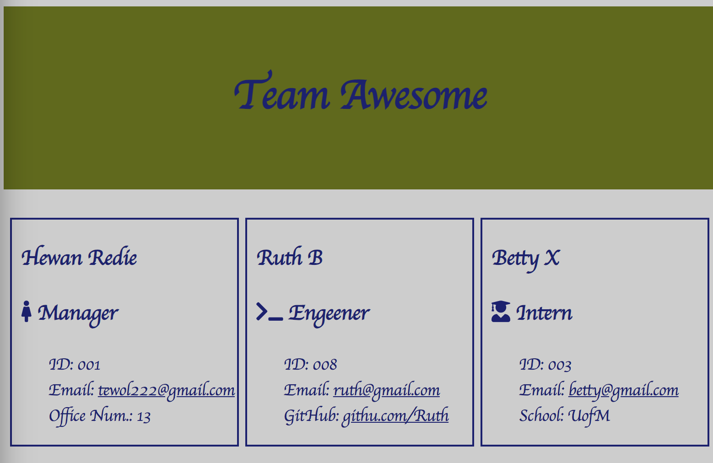

# 10-Team-Profile-Generator-OOP

    `This is a command-line application that takes in information about employees on a software engineering team, then generates an HTML webpage that displays summaries for each person. `

# Functionality

* A nicely formated HTML file will get generated that displays  team roster based on user inputs of team memebers and their informatoin. 

* Clicking an email address in the HTML will open default email program and populates the TO field of the email with the address

* Clicking GitHub username will open GitHub profile in a new tab

* The application starts by prompting you to enter the 
	- Manager’s name, 
	- Manager's ID, 
	- Email address, and 
	- office number

* Entering team manager’s name, ID, email address, and office number will present you with a menu option to add an engineer or an intern or to finish building the team

* Selecting the Engineer option will prompte you to enter the Engineer’s:
	- name, 
	- ID, 
	- email, 
	- GitHub username, and takes you back to the menu

* Selecting the intern option will prompte you to enter the intern’s:
	- name, 
	- ID, 
	- email, 
	- school, and takes you back to the menu
* HTML is generated after finishing building the team and exit application. 

# Mock-up
The following Video demonstrates the application appearance and functionality:

# Testing Result

# Links to the deployed application
* A walkthrough video that demonstrates the functionality:
https://github.com/Tewol/10-team-profile-generator-oop/blob/main/images/demo.gif

* Sample HTML file generated using your applicatio: https://tewol.github.io/10-team-profile-generator-oop/output/

* A URL of the GitHub repository: https://github.com/Tewol/10-team-profile-generator-oop

© 2021 Hewan Redie

